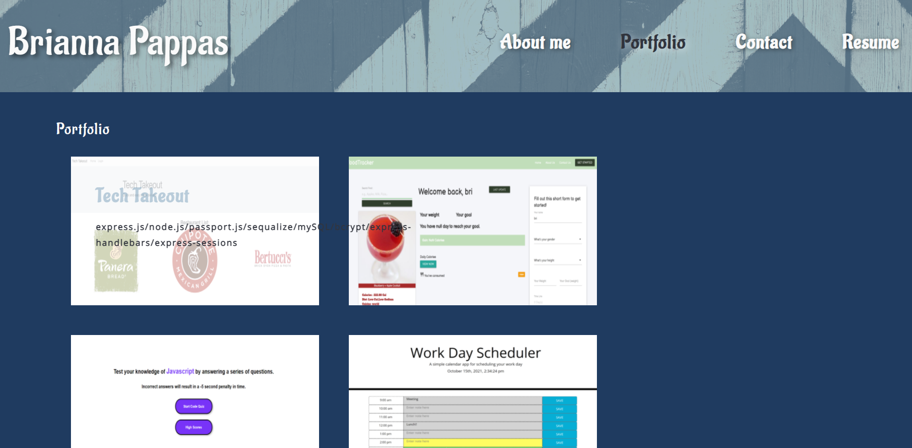

# 20 React: React Portfolio


## **React Portfolio:** Brianna Pappas

## Your Task
```md
Create a portfolio using React. 
Deploy application to GitHub Pages. 
```
## User Story

```md
AS AN employer looking for candidates with experience building single-page applications
I WANT to view a potential employee's deployed React portfolio of work samples
SO THAT I can assess whether they're a good candidate for an open position
```

<br/>

## Final product 

<br/>

### Home Page / About Me


<br/>

### Portfolio page / Projects


<br/>

### Contact page


<br/>

### Resume page 


<br/>

## Links
<br/>

 [Click here](https://github.com/bripap) to visit Github repo.
 <br/>
 [Click here](https://bripap.github.io/react-portfolio/) for deployed application
